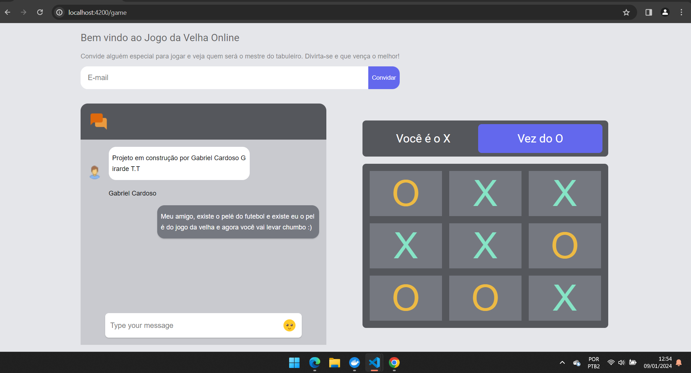

# Jogo da Velha Online

(Em construção)

Resolvi criar uma simples aplicação que utilizará websockets para se comunicar em tempo real, além de contar com autenticação de usuário. Esse frontend terá comunicação com o projeto que está no repositório -> https://github.com/GNobroga/JogoDaVelhaWebsocketBackend

